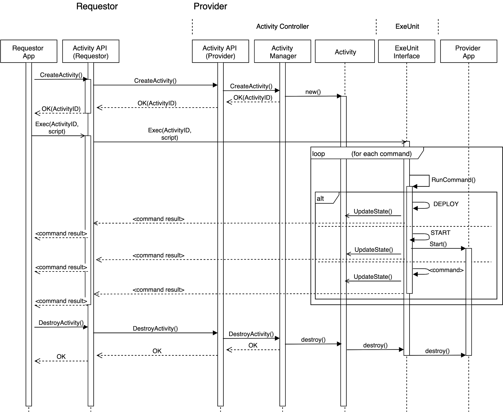

# Golem Activity API

Golem Activity API

Specification

Version 1.2

## Abstract

The purpose of this paper is to define a logical API for Activity-related operations in Golem Network node implementations. It does not specify the actual implementation of Golem Activity protocol, but rather indicates an interface which must be implemented by such implementations. “ExeUnit” logical component is described to model the interface required from any Execution Environment hosted on Provider Node. Activity Protocol Capability Segments concept is introduced to define modular structure of Activity-related protocols. All Golem-compliant Activity API implementations are expected to conform to the protocols and interaction sequences described in this article.

## Scope

The Activity API can be perceived as a control mechanism which enables a Requestor-side application to steer the execution of an Activity as specified in an Agreement which has been negotiated via the Market API/Protocol. This defines possible interactions between the Requestor application \(via Activity API\) and the generic components running on the Provider node, which host the Provider-side application code.

The possible interactions imply a logical “execution environment” component, which is the host/container for the “payload” code. The “execution environment” is specified as an **ExeUnit**, with a generic interface via which a Provider node’s Activity Controller can operate the hosted code.

The Activity API defines the following interfaces:

* Requestor App -&gt; Activity API - so the “controls” available to a Requestor-side application,
* Activity Controller \(“Provider Agent”\) -&gt; ExeUnit - so the “controls” which Provider’s Golem Daemon uses to instantiate, launch, monitor and destroy the execution environments,
* Provider App -&gt; ExeUnit - the ways of interaction of the hosted Provider-side application with the outside world via the ExeUnit.

## Overview

### Activity State Diagram

Note: An error happening on any state transition may be fatal and thus lead to Activity state changing to Terminated. Those “fatal error” transitions are omitted in the diagram, for clarity.

### Activity API vs ExeUnit Interface vs App SDK Interface

Three layers can be defined within the Activity API logical structure:

**Activity API Operations** - includes Activity API operations which are available to Requestor App as API calls. These are high-level [Control]() and [State]() operations as described further in the document.

**ExeUnit Operations** - includes operations requested directly from Provider App’s ExeUnit via Exec\(\) call which executes [ExeScript]() command batches.

**App SDK Operations** - includes operations available to an App running within the ExeUnit - effectively a standardized way via which a hosted Provider App can communicate with Golem ecosystem. NOTE: this layer is out-of-scope of initial edition of Activity API.

### Authorisation Aspects

The Activity instantiated in the Golem Ecosystem shall maintain its Access Control List to indicate the Golem Nodes having specific rights to the Activity.

Following rights can be granted:

* Control - indicates the right to control the activity \(execute commands against it\). This right is granted to the creator of the Activity at the moment of creation **\(but is it transitive, ie. can it then be granted further to other golem nodes???\)**.
* Host - indicates the right to host the activity, ie. right to instantiate it. By default this is granted to the Provider where the Activity is created \(so the Provider indicated in the Agreement\).
* Observe - indicates the right to read and observe the Activity \(eg. query Activity state, listen to Events raised by the Activity\). By default this is granted to the creator of the Activity.

**\(How granular do we want to go here? I wouldn’t want to start defining rights to execute eg. every command of ExeScipt, etc.\)**

## API Segments

### Control

This API segment includes operations which control the Activity lifecycle.

The basic flow of Activity control is illustrated below:

**Notes:**

* The Activity is initiated via explicit CreateActivity\(\) call, which is expected to return a unique ActivityID. All other operations related to that Activity shall be labelled with this ActivityID.
* All other control over Activity is exercised via ExeScript commands \(see [below]() for more information on ExeScript\).
* The ExeScript block sent by Activity API client shall be routed directly to the ExeUnit instance by the Activity API Requestor implementation. The Exec\(\) call shall marshall a collection of commands.
  * Note that the body of a command is obscure to the Golem Daemon infrastructure \(Activity API, Activity Manager\) - eventually it shall be routed to the relevant ExeUnit where the command body may be decoded \(this is especially relevant to scenarios where the command content is encrypted end-to-end between Requestor and the ExeUnit implementation, eg. in SGX-enabled scenarios\)
* As the ExeScript command block is received by the ExeUnit instance, the commands are interpreted, and executed, eg.:
  * DEPLOY command triggers an ExeUnit deployment/instantiation
  * DESTROY command scraps an existing ExeUnit regardless of its state
* All the authorization logic must be executed on the Provider side, by the Activity Manager module.

#### API Operations

**CreateActivity\(AgreementID\)**

**Inputs:**

* AgreementID \(mandatory\)

**Outputs:**

* ActivityID or
* Error

**Conditions:**

* Authorization: This method can only be called by Requestor Node which is the issuer of the Demand included in the Agreement. **\(or is somehow authorised by the Agreement Requestor - but we don’t have such a ‘delegation’ mechanism???\)**

**Description:**

Create a new Activity object within the context of a given Agreement. This operation is synchronous and returns newly created ActivityID.

The Activity is created in New state.

**Exec\(ActivityID, ExeScript\)**

Executes a set of ExeScript commands in the context of created Activity.

**Inputs:**

* ActivityID
* ExeScript text \(see below\)

**Outputs:**

* OK\(BatchID\) - indication that script was accepted for execution on Provider Node, including BatchID, unique identifier of the ExeScript batch execution thread, or
* SyntaxError - in case of ExeScript syntax errors

**Conditions:**

* Authorisation: This method can only be called by Node having Control right to the Activity.

**Description:**

* The Exec\(\) method must implement the ExeScript execution model \(as described [here]()\)

**GetExecBatchResults\(ActivityID, BatchID\)**

Collects the result sets returned while ExeScript batch is executing.

**Inputs:**

* ActivityID
* BatchID
* Timeout
* MaxCount

**Outputs:**

* List of ResultSets from subsequent commands executed within ExeScript batch.

**Conditions:**

* Authorisation: This method can only be called by Node having Control right to the Activity.

**Description:**

* The GetExecBatchResults\(\) method implements the ExeScript execution results model \(as described [here]()\)

**DestroyActivity\(ActivityID\)**

**Inputs:**

* ActivityID \(mandatory\)

**Outputs:**

* OK or
* Error

**Conditions:**

* Authorisation: This method can only be called by Node having Control right to the Activity.

**Description:**

This call sends a message to Provider to abort the Activity regardless of its state. This operation is synchronous and returns the outcome result code.

The call is expected to release resources taken by ExeUnit for the Activity.

The Activity shall be moved to Terminated state.

#### ExeScript

The Activity can be controlled by Requestor via ExeScript commands. The concept is similar to eg. SQL commands being executed on a Relational DBMS.

**Syntax**

ExeScript syntax is taken after from the syntax of [Docker files](https://docs.docker.com/engine/reference/builder/). An ExeScript block consists of:

* Comments and
* Statements/commands

**Comments**

A comment is a line of text which begins with \# character:

\# This is a comment line

**Statements**

A statement is an expression which follows a general format of:

&lt;COMMAND&gt; \(&lt;arg1&gt; … &lt;argn&gt;\)

Commands are not case-sensitive but the convention is for them to be UPPERCASE.

**Execution Model**

* The ExeScript code shall be passed to the ActivityAPI Exec\(\) call as text parameter. The code block may contain one or more commands.
* The ExeScript body gets parsed into a collection of commands, which is marshalled to Provider side and routed into ActivityController and relevant ExeUnit.
* The commands are executed sequentially.
* Each command’s execution concludes with a result \(either OK or Error+Error Message\) which may include additional arbitrary content, relevant to a specific ExeUnit. The result of each command shall be routed back to the calling Requestor so that it can be processed by a calling Requestor App before the whole Exec\(\) call completes \(ie. the results are returned asynchronously, while subsequent commands are executing\).
* If a command ends with Error result, the command batch is immediately halted \(ie. it does not progress further\).

**Commands**

**DEPLOY**

Initiates deployment of ExeUnit for the newly created Activity.

**Syntax:**

DEPLOY

**Acceptable states:** New

**Successor states:**

* Deploying -&gt; Ready in case of success,
* New in case of “recoverable” error
* Terminated in case of fatal deployment error

**Capability level:** 1

**Description:**

* When deployment is completed successfully, the ExeUnit is ready to accept START command.
* TODO: Do we need additional parameters here? This may be ExeUnit implementation-specific, eg. we may need this to pass SGX enclave hash of payload application?

**START**

Launches the Activity on the instantiated ExeUnit.

**Syntax:**

START &lt;params&gt;

**Acceptable states:** Ready

**Successor states:**

* Starting-&gt;Active if started successfully
* Terminated or Ready in case of launch error \(depending on how severe the error was???\)

**Capability level:** 1

**Description:**

* ...

**RUN**

Runs arbitrary command on the ExeUnit. The semantics of a command is specific to the ExeUnit, eg. for containerized applications, RUN would run an OS command \(as if from command prompt\).

**Syntax:**

RUN &lt;command&gt;

**Acceptable states:** Active

**Successor states:** Active

**Capability level:** 1?

**Description:**

* Every compliant ExeUnit type must define the semantics of RUN command.

**SUSPEND**

Suspends the Activity on the instantiated ExeUnit.

**Syntax:**

SUSPEND

**Acceptable states:** Active

**Successor states:**

* Suspending-&gt;Suspended

**Capability level:** 2

**Description:**

* ...

**RESUME**

Resumes the suspended Activity on the instantiated ExeUnit.

**Syntax:**

RESUME

**Acceptable states:** Suspended

**Successor states:**

* Resuming-&gt;Active

**Capability level:** 2

**Description:**

* ...

**TRANSFER**

Transfers data to/from ExeUnit.

**Syntax:**

TRANSFER &lt;source uri&gt; &lt;target uri&gt;

**Acceptable states:** Ready, Active

**Successor states:** \(no change\)

**Capability level:** 1

**Description:**

* This command is used to eg. populate the input or collect output for some types of ExeUnits.
* The semantics of a command is specific to the ExeUnit, eg. for containerized applications, TRANSFER could be used to place arbitrary content in selected location of container’s file system.
* The source/target uris shall point to Provider’s local or remote location.
  * A local location uri shall bear no protocol prefix.
  * A remote location uri is identified by a protocol prefix.
  * TRANSFER may be executed between local and remote uris. The ExeUnit shall specify the supported local/remote TRANSFER matrix, eg.:

| source | target |  |
| :--- | :--- | :--- |
| local | remote |  |
| local | optional | Y |
| remote | Y |  |

* * The remote location shall be contacted by calling a ProtocolProvider component \(specific to the remote uri protocol\) which is part of ExeUnit implementation.
  * The ProtocolProvider shall provide two basic operations: Get\(\) and Put\(\)
    * Put\(\) operation may result with an Done/Error simple result or a Created result which includes a meaningful information about the resource, eg. identifies the uploaded resource.

**Generic flow:**

**Protocols:**

* An ExeUnit shall declare a list of supported protocols, it shall be a property of an ExeUnit component. The protocol code shall also be used to prefix the URI of a remote location passed as parameter to TRANSFER. Example protocols are listed below:
  * http, https
  * hyperg
  * dat - the DAT protocol \([https://docs.datproject.org/](https://docs.datproject.org/)\)
  * gfp - Golem File Protocol, proprietary distributed file storage protocol
  * ...others?

**Examples:**

* Fetch content from CDN and place in container’s local filesystem:

TRANSFER https://cdn.dblah.com/c34ba6512ca /images/thumb1.jpg

* Send content from Requestor’s filesystem to container’s filesystem \(on Provider side\). Sequence is as follows:

Requestor-side software “registers” a file as resource and receives resourceid, then calls:

TRANSFER gfp://&lt;nodeid&gt;/&lt;resourceid&gt; /resources/test.blend

The ExeUnit fetches the resource from Requestor’s node and stores it in container’s filesystem in resources directory under test.blend filename.

* Collect output from container’s filesystem location to Requestor’s filesystem

Requestor-side software registers a “placeholder” for incoming resource, and obtains resourceid:

TRANSFER /resources/output.jpg gfp://&lt;nodeid&gt;/&lt;resourceid&gt;

The ExeUnit uploads the output.jpg file to the prepared placeholder.

* Send output from container’s filesystem to some web location via HTTP/S

TRANSFER /output/render.jpg https://dropbox.com/c34ba6512ca

**Commands for consideration**

The commands described below can be potentially useful in building rich, functional Golem Applications, however they do not seem fundamental for most use case scenarios.

**FORWARD**

Open TCP-like communication pipe between the payload of ExeUnit \(eg. the hosted container\) and the Requestor’s side App.

**Syntax:**

FORWARD &lt;requestor side channel id&gt; &lt;hosted app side endpoint spec: \(port\)/\(protocol\)&gt;

**Acceptable states:** All

**Successor states:** \(no change\)

**Capability level:** 2

**Description:**

* The channel which is created is visible from Requestor side as the channel Id. There is a corresponding Activity API operation which allows to send content into this channel **\(which methods???\)**.
* The channel manifests itself on ExeUnit’s payload side as eg:
  * TCP port \(for containerized apps, VMs\)
  * Emulated TCP socket for WASM modules?
* The application payload \(hosted in ExeUnit\) may connect to the channel by opening a TCP-like socket.

Example:

FORWARD myAppPipe 34521/tcp

**RAISEVENT**

Raise an Event that can be observed by Provider, and potentially also other nodes, as per Observe right.

**Syntax:**

RAISEVENT &lt;event channel name&gt; &lt;event payload, eg. JSON&gt;

**Acceptable states:** Active

**Successor states:** \(no change\)

**Capability level:** 2

**GRANT**

Grants particular right on Activity to specific golem Node.

**Syntax:**

GRANT &lt;right name&gt; &lt;node id&gt;

**Acceptable states:** All

**Successor states:** \(no change\)

**Capability level:** 2

**REVOKE**

Opposite to GRANT - revokes particular right on Activity from specific golem Node/s.

**Syntax:**

REVOKE &lt;right name&gt; &lt;node id&gt;

**Acceptable states:** All

**Successor states:** \(no change\)

**Capability level:** 2

#### ExeScript Implementation Notes

The ExeScript is designed to be a facade published by every ExeUnit implementation. Each ExeUnit must hide underlying complexity behind the ExeScript command implementations where possible, so that logically the Requestor App running the ExeScript commands is unaware of the implementation details.

The table below indicates key highlights of Activity API method and ExeScript command implementations:

<table>
  <thead>
    <tr>
      <th style="text-align:left"></th>
      <th style="text-align:left"><b>HostDirect</b>
      </th>
      <th style="text-align:left"><b>Docker</b>
      </th>
      <th style="text-align:left"><b>VM</b>
      </th>
      <th style="text-align:left"><b>SGXExeUnit</b>
      </th>
      <th style="text-align:left"><b>WASM</b>
      </th>
    </tr>
  </thead>
  <tbody>
    <tr>
      <td style="text-align:left"><em>Summary</em>
      </td>
      <td style="text-align:left">Executes a package of binaries directly on Provider host machine</td>
      <td
      style="text-align:left">Launches a containerized application package in Docker</td>
        <td style="text-align:left">Runs a Virtual Machine from given image</td>
        <td style="text-align:left">Executes a package of binaries in a safe enclave on an SGX-enabled CPU.</td>
        <td
        style="text-align:left">Execute a package of WebAssembly code</td>
    </tr>
    <tr>
      <td style="text-align:left">CreateActivity()</td>
      <td style="text-align:left">
        
Reserve resources.

        
Extract binary package location from Agreement.

      </td>
      <td style="text-align:left">
        
Reserve resources.

        
Extract Docker image location from Agreement.

      </td>
      <td style="text-align:left">
        
Reserve resources.

        
Extract VM image location from Agreement.

      </td>
      <td style="text-align:left">
        
Reserve resources.

        
Extract binary package location from Agreement.

        
Start enclaved &#x201C;agent&#x201D;

        
Establish secure communication between Requestor and SGXExeUnit &#x201C;agent&#x201D;:

        
- ?Proxy must generate Req public key and pass to &#x201C;agent&#x201D;,
          the SetupSGX must happen in exeunit, agent must respond with SGX package

        
- ?Proxy performs quote validation and probably IAS attestation call

      </td>
      <td style="text-align:left">
        
Reserve resources.

        
Extract WebAssembly package location from Agreement.

      </td>
    </tr>
    <tr>
      <td style="text-align:left">DEPLOY</td>
      <td style="text-align:left">Download binary package - an image contains a set of binaries which a
        Provider App requires</td>
      <td style="text-align:left">Pull image</td>
      <td style="text-align:left">Download VM image</td>
      <td style="text-align:left">Pull &#x201C;SGX-enabled&#x201D; binary package</td>
      <td style="text-align:left"><em>&lt;no repo concept yet for WebAssembly apps&gt;</em>
      </td>
    </tr>
    <tr>
      <td style="text-align:left">START &lt;params&gt;</td>
      <td style="text-align:left">Start app entrypoint binary with params</td>
      <td style="text-align:left">docker run &lt;params&gt;</td>
      <td style="text-align:left">Start vm</td>
      <td style="text-align:left">
        
In simple view: &#x201C;dynamic loader&#x201D; runs and resolves all glibc
          calls in the executed binary.

        
Starts the enclave and loads with binary code,

        
Starts the &#x201C;enhanced&#x201D; binary code execution.

      </td>
      <td style="text-align:left"></td>
    </tr>
    <tr>
      <td style="text-align:left">RUN &lt;params&gt;</td>
      <td style="text-align:left">&lt;may be used to run &#x201C;side-processes&#x201D; using given command
        line, but only</td>
      <td style="text-align:left"></td>
      <td style="text-align:left"></td>
      <td style="text-align:left">&lt;in simple view, each RUN does again what START does but starting a
        new enclave&gt;</td>
      <td style="text-align:left"></td>
    </tr>
    <tr>
      <td style="text-align:left">TRANSFER &lt;src&gt; &lt;tgt&gt;</td>
      <td style="text-align:left">Triggers data streaming between selected Protocol Provider and local</td>
      <td
      style="text-align:left"></td>
        <td style="text-align:left"></td>
        <td style="text-align:left"></td>
        <td style="text-align:left"></td>
    </tr>
    <tr>
      <td style="text-align:left">DestroyActivity()</td>
      <td style="text-align:left">
        
Kill all processes launched by START and RUN commands.

        
Release resources.

        
Remove the ExeUnit instance.

      </td>
      <td style="text-align:left">
        
Kill all processes launched by START and RUN commands.

        
Release resources.

        
Remove the ExeUnit instance.

      </td>
      <td style="text-align:left">
        
Kill all processes launched by START and RUN commands.

        
Release resources.

        
Remove the ExeUnit instance.

      </td>
      <td style="text-align:left">
        
Kill all processes launched by START and RUN commands.

        
Remove all created enclaves.

        
Release resources.

        
Remove the ExeUnit instance.

        
<em>&lt;Any additional SGX-specific activities???&gt;</em>
        

      </td>
      <td style="text-align:left">
        
Kill all processes launched by START and RUN commands.

        
Release resources.

        
Remove the ExeUnit instance.

      </td>
    </tr>
  </tbody>
</table>

### State

This API segment includes operations which query the Activity state.

#### API Operations

**GetState\(ActivityID\)**

Get state information of the Activity.

**Inputs:**

* ActivityID \(mandatory\)

**Outputs:**

* Activity State or
* Error

**Conditions:**

* Authorization: This method can only be called by Node which has the Observe right to the Activity.

**Description:**

Queries the state of the Activity.

**GetCurrentUsage\(ActivityID\)**

Get current usage vector of the Activity.

**Inputs:**

* ActivityID \(mandatory\)

**Outputs:**

* Usage vector value or
* Error

**Conditions:**

* Authorization: This method can only be called by Node which has the Observe right to the Activity.

**Description:**

Queries the usage vector of the Activity. Can be called in any Activity state.

**GetRunningCommand\(ActivityID\)**

Query the ExeScript command which is currently running in the context of the Activity.

**Inputs:**

* ActivityID \(mandatory\)

**Outputs:**

* List of Current ExeScript statement text or
* Error

**Conditions:**

* Authorization: This method can only be called by Node which has the Observe right to the Activity.

**Description:**

Queries the ExeScript statement which is currently executing in the context of the Activity.

### Events \(for consideration\)

This API segment includes operations which allow the Requestor Application to communicate with outside world via Event publish/subscribe mechanism.

#### API Operations

**ListenEvent\(ActivityID, EventType\)**

Allows the Requestor to receive event notifications from the Activity.

**Inputs:**

* ActivityID \(mandatory\)
* EventType \(mandatory\)

**Outputs:**

* Event information \(optional\)
* Error

**Conditions:**

* Authorization: This method can only be called by Node which has the Observe right to the Activity.

**Description:**

\(TODO\)...

## Example Scenarios

TODO :

* Activity API interaction sequence diagrams
* Samples of ExeScripts, eg. to execute Blender computation task.

