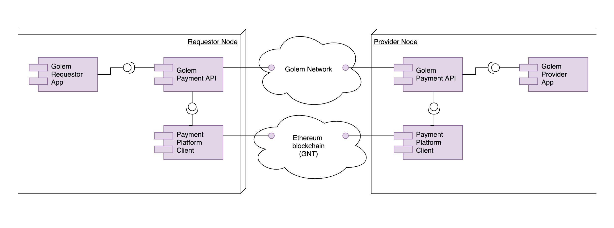
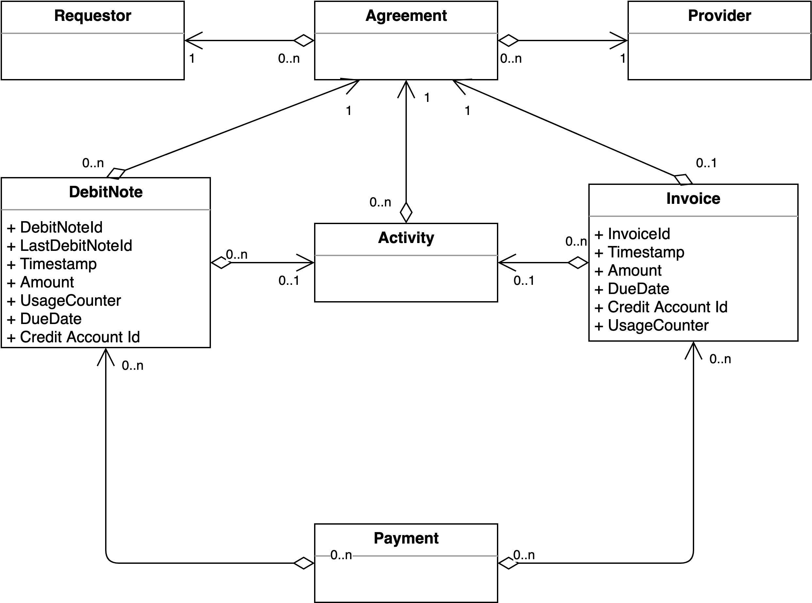
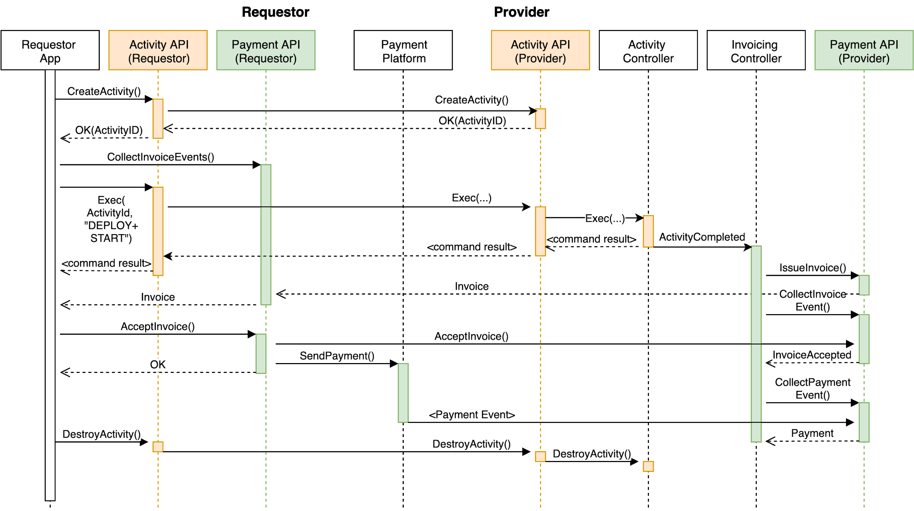
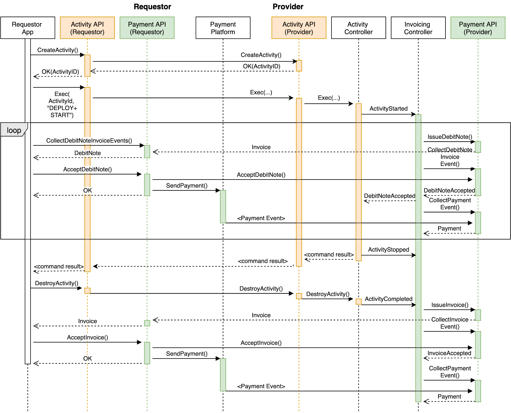

# Golem Payment API

Golem Payment API

Specification

Version 1.1

## Abstract

The purpose of this paper is to define a logical API for Invoicing and Payment operations in Golem Network node implementations. It does not specify the actual implementation of Payment platform protocol, but rather indicates an interface which must be implemented by such platforms. All Golem-compliant Payment API implementations are expected to conform to the protocols and interaction sequences described in this article.

## Intro

Invoicing and Payments is a fundamental area of Golem Ecosystem functionality. It includes aspects of communication between Requestor, Provider and a selected Payment Platform, which becomes crucial when Activities are executed in the context of negotiated Agreements. Golem Applications must be able to exercise various payment models, and the Invoicing/Payment-related communication is happening in parallel to Activity control communication. To define functional patterns of Requestor/Provider interaction in this area, Payment API is specified.

An important principle of the Golem Payment API is that the actual payment transactions are hidden behind the Invoice flow. In other words, a Golem Application on Requestor side isn’t expected to trigger actual payment transactions. Instead it is expected to receive and accept Invoices raised by the Provider - based on Application’s Invoice Accept notifications, the Payment API implementation orchestrates the payment via a configured Payment platform.

Note that the concept of integration of Payment Platform client in the Payment API implementation has a number of advantages:

* Developers of Requestor-side Applications don’t need to be bothered with details of Payment Platform integration, transaction mechanics, portfolio key management, etc.
* Payment API implementations are able to optimize the payment mechanics \(eg. reduce cost of Ethereum transactions by leveraging payment batching\) or even select various Payment Platforms \(eg. Plasma, once mature, seems a potent payment mechanism for micro-transactions\).

The Payment API specificies minimum functionality that Payment Platform must provide to meet the purposes of Golem ecosystem.

## Domain Model

The following diagram illustrates the relationships between entities in the Invoice/Payment domain:

### Debit Note

A Debit Note is an artifact issued by the Provider to the Requestor, in the context of a specific Agreement. It is a notification of Total Amount Due incurred by Activites in this Agreement until the moment the Debit Note is issued. This is expected to be used as trigger for payment in upfront-payment or pay-as-you-go scenarios.

A Debit Note contains:

* Debit Note Id
* \(Optional\) Previous Debit Note Id - points at the last Debit Note issued in this Agreement - the Debit Note Ids shall be monotonously increasing and will enable arranging the Debit Notes in a sequence
* Timestamp
* Agreement Id \(Hash?\)
* \(Optional\) Activity Id
* Total Amount Due - total, aggregated Amount Due incurred by this Agreement - this will monotonously increase with each subsequent invoice and will be helpful in reconciliation.
* \(Optional\) Usage Counter Vector \(basis for amount\)
* Credit Account Id
* \(Optional\) Payment Platform - if specified, indicated Provider requests a specific platform to be used for payment of this Debit Note
* \(Optional\) Payment Due Date - if specified, indicated a request for payment \(eg. in pay-as-you-golem scenarios, accepting such a Debit Note is mandatory to continue the Activity\).

**Notes:**

* Debit Notes flag the current Total Amount Due, which is accumulated from the start of Agreement. Debit Notes are expected to trigger payments, therefore payment amount for the newly received Debit Note is expected to be determined by difference of Total Payments for the Agreement vs Total Amount Due.
* A Debit Note can be issued even before any Activity is started in the context of an Agreement \(eg. in one off, “fire-and-forget” payment regime\).

### Invoice

An Invoice is an artifact issued by the Provider to the Requestor, in the context of a specific Agreement.

* It indicates the total Amount owed by the Requestor in this Agreement.
* No further Debit Notes shall be issued after the Invoice is issued.
* The Invoice is the last payment related artifact issued within an Agreement.
  * Note this implies the Provider Agent shall not allow any Activity execution after the Invoice is issued.

An Invoice contains:

* Invoice Id
* \(Optional\) Last Debit Note Id - points at the last Debit Note issued in this Agreement
* Timestamp
* Agreement Id \(Hash?\)
* \(Optional\) Activity Ids
* Amount
* \(Optional\) Usage Counter Vector \(basis for amount\)
* Credit Account Id
* \(Optional\) Payment Platform - if specified, indicated Provider requests a specific platform to be used for payment for this Invoice
* Payment Due Date

**Notes:**

* In one-off, “fire-and-forget” payment regime, an invoice can be issued after the Requestor has disconnected from the network. This is still OK for the Provider, as the payment has been already made on the basis of an originally issued Debit Note. However this also means the Invoice would not be delivered to the Requestor.

#### Invoice/Debit Note State Diagram

**Notes:**

* Accepted state indicated that the Requestor confirms the Amount/Total Amount Due on the Invoice/Debit Note, respectively. The Payment API Implementation is expected to proceed with the orchestration of the payment. Internals of the payment processing \(eg. payment processing internal states\) are specific to the selected Payment Platform, and must be indicated as an attribute of the Accepted state. However, as they are specific - they shall not be standardized by the Payment API.
* A Rejected Invoice/Debit Note can subsequently be Accepted.
* An Accepted Invoice/Debit Note cannot be subsequently Rejected.
* There is a difference between Paid and Settled - depending on a Payment Platform:
  * Paid indicates that the Requestor has ordered Payments of Total Amount Due as indicated by received/accepted Debit Notes / Invoice
  * Settled indicates that the Provider has reliably received the Payments.

## Functional Requirements

### Invoicing

Main feature of this API is Debit Note / Invoice transfer.

#### Issue an Debit Note/Invoice

A Provider must be able to issue a Debit Note or Invoice which must reach the Requestor. The Requestor is expected to confirm the artefact reception by responding with either Accept or Reject message.

#### Accept/Reject Debit Note/Invoice

Requestor which receives a Debit Note / Invoice shall respond immediately with Accept or Reject message.

### Payments

While we assume that the payments for Golem resources are to be made in GNT tokens, it is possible to implement various payment mechanisms \(eg. apart from “traditional” Ethereum-based payments, we can imagine Layer2 platforms, eg. Plasma-based payments which in theory have much lower transaction costs....\) Therefore the Golem Payment API must specify requirements which must be implemented by the payment platform, so that it can be integrated in Golem.

**Note:** there is no need for explicit “Send Payment” operations in the Payment API - the payments are triggered by AcceptInvoice messages. It is up to the implementation to orchestrate the payments based on the AcceptInvoice statements.

#### Lock/Allocate funds for spend

Make an upfront allocation of the funds so that they are not spent elsewhere.

#### Pay to specified account by given date

It must be possible to issue payment of specified GNT amount to account address specified on the Debit Note or Invoice, so that the payment is made before a specified date. Note that we do not restrict the Payment-Debit Note/Invoice relationship, ie. it is possible to make partial payments, or pay for a number of Invoices in one payment.

#### Payment authorization \(???\)

The payment platform must have an authorization mechanism to require payee authorization \(eg. on bulk payments\).

#### Payment reconciliation

The Invoice issuer must be capable of matching the payment with Debit Note\(s\)/Invoice\(s\).

**Note:** We must consider implementations of the payment platform \(compliant with requirements above\) using a\) “traditional” Ethereum, b\) PLASMA. Ie. it must be explained how a selected payment mechanism implements the requirements above.

#### Notes on payment batching

Currently payment batching is considered as a way to optimise gas spend on Ethereum transactions

* Currently batches can serve multiple payments to one Provider as well as payments to multiple providers in one transaction \(sic!\)
* Monotonous “nonce” \(timestamp-based\) included with payments - to help reconciliation

In generic world, a one-dimensional monotonous nonce is not sufficient for reconciliation, as:

* Requestor may choose the invoices that he pays for, and the payments may not be in sequence of Invoices arrival, nor in sequence of Invoices’ due date

## API Operations

### AllocateAmount

Operation to make an allocation of funds to make sure they are not spent elsewhere.

**Who:**

* **Requestor**

**Input:**

* Amount
* \(Optional\) Timeout
* MakeDeposit flag???

**Output:**

* OK \(AllocationId\)
* Error \(error code, eg. insufficient funds\)

**Description:**

* Should this method also implement externally visible Deposits???

### AmendAllocation

Operation to resize an existing allocation.

**Who:**

* **Requestor**
* **Provider**

**Input:**

* AllocationId
* Amount
* \(Optional\) Timeout

**Output:**

* OK
* Error

### GetAllocationDetails

Operation to extract the current state of allocation \(total amount, amount spent already, amount left, etc.\)

**Who:**

* **Requestor**
* **Provider**

**Input:**

* AllocationId

**Output:**

* Amounts vector

### ReleaseAllocation

Operation to release a previously locked Allocation.

**Who:**

* **Requestor**
* **Provider**

Input:

* AllocationId

Output:

* OK

Description:

* The Allocation of amount is released. Note that this operation releases currently allocated amount \(which may have been reduced by subsequent Invoice Payments\).
* If the Allocation was connected with a Deposit - the release amount from Deposit shall be marked as pending to be paid back to Requestor - and eventually will be paid back, unless a subsequent Allocation with Deposit is made. The Payment Platform implementations may optimize unnecessary fund transfers \(ie. will not pay back the Deposit if released funds can be assigned to a new Allocation with Deposit\).

### IssueDebitNote

Operation called by Provider process to create and send a Debit Note to the Requestor.

**Who:**

* **Provider**

**Input:**

* Debit Note artifact
* Response Timeout

**Description:**

* Send Debit Note artifact and await ACK.
* This operation is **synchronous** \(ie. it must implement Ack and Retry mechanism\)

### IssueInvoice

Operation called by Provider process to create and send an Invoice to the Requestor.

**Who:**

* **Provider**

**Input:**

* Invoice artifact
* Response Timeout

**Description:**

* Send Invoice artifact and await ACK.
* This operation is **synchronous** \(ie. it must implement Ack and Retry mechanism\)

### CancelDebitNote

Operation called by Provider process to cancel an already sent Debit Note to the Requestor.

**Who:**

* **Provider**

**Input:**

* Debit Note Id

**Output:**

* OK or Err \(if an invoice has already moved to state in which it cannot be cancelled\).

**Description:**

* Send Debit Note Id and await ACK.
* This operation is **synchronous** \(ie. it must implement Ack and Retry mechanism\)

### CancelInvoice

Operation called by Provider process to cancel an already sent Invoice to the Requestor.

**Who:**

* **Provider**

**Input:**

* Invoice Id

**Output:**

* OK or Err \(if an invoice has already moved to state in which it cannot be cancelled\).

**Description:**

* Send Invoice Id and await ACK.
* This operation is **synchronous** \(ie. it must implement Ack and Retry mechanism\)

### CollectDebitNoteInvoiceEvent

Method used by Application process to collect Invoices arriving from network.

**Who:**

* **Requestor**
* **Provider**

**Input:**

* Timeout
* Max Count

**Output:**

* Collection of Events received from the network.
* Event types:
  * DebitNoteReceived \(Debit Note\)
  * DebitNoteAccepted \(Debit Note Id\)
  * DebitNoteRejected \(Debit Note Id, additional data???\)
  * DebitNoteCancelled \(Debit Note Id\)
  * InvoiceReceived \(Invoice\)
  * InvoiceAccepted \(Invoice Id\)
  * InvoiceRejected \(Invoice Id, additional data???\)
  * InvoiceCancelled \(Invoice Id\)

### AcceptDebitNote

Method called by Requestor process to signal Debit Note acceptance to Debit Note Issuer.

**Who:**

* **Provider**

**Input:**

* Debit Note Id
* Total Amount Accepted - aggregated Amount Due accepted by the Requestor, this will be helpful in reconciliation \(ie. Total Amount Due from Provider side should equal Total Amount Accepted by Requestor\)
* \(Optional\) AllocationId

**Description:**

* Sends Debit Note Accepted message to Debit Note Issuer. Triggers payment orchestration for this Debit Note \(using allocated lot identified by AllocationId if any\).
* **NOTE:** An Accepted Debit Note cannot be Rejected later.

### AcceptInvoice

Method called by Requestor process to signal Invoice acceptance to Invoice Issuer.

**Who:**

* **Provider**

**Input:**

* Invoice Id
* Total Amount Accepted - aggregated Amount Due accepted by the Requestor, this will be helpful in reconciliation \(ie. Total Amount Due from Provider side should equal Total Amount Accepted by Requestor\)
* \(Optional\) AllocationId

**Description:**

* Sends Invoice Accepted message to Invoice Issuer. Triggers payment orchestration for this invoice \(using allocated lot identified by AllocationId if any\).
* **NOTE:** An Accepted invoice cannot be Rejected later.

### RejectDebitNote

Method called by Requestor process to signal Debit Note rejection to Debit Note Issuer.

**Who:**

* **Requestor**

**Input:**

* Debit Note Id
* Total Amount Accepted - aggregated Amount Due accepted by the Requestor, this will be helpful in reconciliation.
* Reject Reason data
* Additional data?

**Description:**

* Sends Debit Note Rejected message to Debit Note Issuer.
* Notification of rejection is signalling that Requestor does not accept Debit Note \(for some reason\)
* **NOTE:** A Rejected debit note can be Accepted subsequently \(eg. as a result of some arbitrage\)

#### Rejection reasons

See RejectInvoice-&gt;Rejection reasons

### RejectInvoice

Method called by Requestor process to signal Invoice rejection to Invoice Issuer.

**Who:**

* **Requestor**

**Input:**

* Invoice Id
* Reject Reason data
* Additional data?

**Description:**

* Sends Invoice Rejected message to Invoice Issuer.
* Notification of rejection is signalling that Requestor does not accept Invoice \(for some reason\)
* **NOTE:** A Rejected invoice can be Accepted subsequently \(eg. as a result of some arbitrage\)

#### Rejection reasons

Do we need to create enum for the acceptable reasons? Following can be considered:

* Unsolicited service - The Requestor flags that Provider raises an invoice for a service which hasn’t been ordered or hasn’t been launched yet
* Bad service - The service provided by the Provider was of insufficient quality \(eg. Requestor verification proves that the calculations were flawed, or that a requested online service wasn’t in fact available online…\)
* Incorrect Amount \(+Amount Accepted\) - The Requestor indicates that the Invoice Amount is incorrect, and provider their proposed Amount for this Invoice.

Do we expect any additional justification for reject?

### CollectPaymentEvent

Method used by Application process to collect notification of Payments arriving from PaymentPlatform.

**Who:**

* **Provider**

**Input:**

* Timeout
* Max Count

**Output:**

* Collection of Payment Events received from the network. Payment Events are notifications of Payments made to the Provider.
* What is included in Payment notification???

### GetPaymentForDebitNote

Method called by Provider to obtain DebitNote-&gt;Payment mapping, required for payment reconciliation.

**Who:**

* **Provider**

**Input:**

* Debit Note Id

**Output:**

* Collection of payment transaction ids or empty if no payment has been made for this Debit Note.

**Description:**

* For given Debit Note Id, return all Payments associated with that Debit Note.

### GetPaymentForInvoice

Method called by Provider to obtain Invoice-&gt;Payment mapping, required for payment reconciliation.

**Who:**

* **Provider**

**Input:**

* Invoice Id

**Output:**

* Collection of payment transaction ids or empty if no payment has been made for this Invoice.

**Description:**

* For given InvoiceId, return all Payments associated with that Invoice.

### GetPaymentDetails

Operation to extract the details of a Payment.

**Who:**

* **Provider**

**Input:**

* Payment Id

**Output:**

* Payment descriptor

## Example Scenarios

### One-off payment “after”

A basic scenario where the Invoice is issued after the Activity is completed/stopped. No Debit Notes are raised in this scenario.

### One-off payment “before”

A scenario where the Provider requires a Debit Note to be accepted before the Activity can be started. After the Activity is completed, an Invoice is issued.

### Pay-as-you-golem

A Pay-as-you-golem scenario, where incremental Debit Notes are issued in parallel with Activity execution. Once Activity is stopped, a closing Invoice is issued.

### Settlement of overpaid charges

\(TODO\)If a service has been paid for upfront, but hasn’t been consumed completely, so the Provider needs to settle the difference by paying back to Debit account. NOTE THIS IS A VARIANT OF “before” and “pay as you golem” scenarios

### Payment via Deposit

\(TODO\)

### Various Payment Platforms

\(TODO\)Allow Requestor/Provider to choose Payment Platforms while the Activity is up and running...

## Implementation notes

* Persistence - it is recommended that following artifacts are recorded for auditing and dispute resolution purposes:
  * Debit Note
  * Invoice

